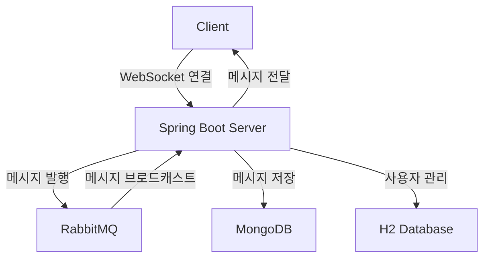
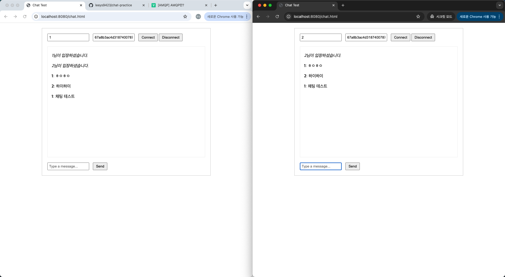

# Chat Application

Spring Boot와 WebSocket을 이용한 실시간 채팅 애플리케이션(MVP 모델)

## 기술 스택

- Spring Boot 3.4.2
- WebSocket (STOMP)
- MongoDB
- RabbitMQ
- H2 Database (User 관리용)
- SockJS
- Lombok

## 시스템 아키텍처

### 서비스 플로우


### 데이터베이스 구조

#### MongoDB Collections

1. chat_rooms
```json
{
    "_id": "ObjectId",
    "name": "String",
    "type": "enum(GROUP, PRIVATE)",
    "participants": ["Long (User IDs)"],
    "createdAt": "DateTime"
}
```

2. chat_messages
```json
{
    "_id": "ObjectId",
    "roomId": "String",
    "senderId": "Long",
    "content": "String",
    "type": "enum(ENTER, TALK, LEAVE)",
    "createdAt": "DateTime"
}
```

#### H2 Database Tables

1. users
```sql
CREATE TABLE users (
    id BIGINT AUTO_INCREMENT PRIMARY KEY,
    email VARCHAR(255) UNIQUE NOT NULL,
    password VARCHAR(255) NOT NULL,
    nickname VARCHAR(50) NOT NULL,
    status VARCHAR(20),
    last_login_at TIMESTAMP,
    created_at TIMESTAMP
);
```

## API 엔드포인트

### User API
- POST /api/users - 사용자 생성
- GET /api/users - 전체 사용자 조회
- GET /api/users/{id} - 특정 사용자 조회
- PUT /api/users/{id} - 사용자 정보 수정
- DELETE /api/users/{id} - 사용자 삭제

### Chat Room API
- POST /api/chat/rooms - 채팅방 생성
- GET /api/chat/rooms - 전체 채팅방 조회
- GET /api/chat/rooms/{roomId} - 특정 채팅방 조회
- GET /api/chat/rooms/users/{userId} - 사용자가 참여한 채팅방 조회

### WebSocket 엔드포인트
- 연결: /ws-chat
- 구독: /topic/chat.{roomId}
- 메시지 발행: /pub/chat.message.{roomId}
- 입장 메시지: /pub/chat.enter.{roomId}

## 추가 구현 필요 사항

1. 보안
    - Spring Security 통합
    - JWT 인증
    - WebSocket 인증 처리

2. 채팅 기능 개선
    - 파일 전송 기능
    - 이미지 전송 기능
    - 읽음 확인 기능
    - 메시지 삭제/수정 기능

3. 사용자 기능
    - 프로필 이미지
    - 상태 메시지
    - 친구 목록

4. 성능 최적화
    - 메시지 페이징
    - 캐싱 (Redis 도입 고려)
    - 이전 채팅 내역 로딩 최적화

5. 모니터링
    - 활성 사용자 모니터링
    - 채팅방 통계
    - 에러 로깅 및 알림

## 프로젝트 실행 방법

1. 필요 소프트웨어 설치
   ```bash
   # MongoDB 설치 (Mac)
   brew tap mongodb/brew
   brew install mongodb-community
   brew services start mongodb-community

   # RabbitMQ 설치 (Mac)
   brew install rabbitmq
   brew services start rabbitmq
   ```

2. 애플리케이션 실행
   ```bash
   ./gradlew bootRun
   ```

3. 테스트
    - H2 Console: http://localhost:8080/h2-console
    - RabbitMQ 관리자: http://localhost:15672 (guest/guest)
    - 채팅 테스트 페이지: http://localhost:8080/chat.html

## 테스트 화면



위 스크린샷은 두 개의 브라우저 창에서 동일한 채팅방에 접속하여 실시간으로 대화하는 모습을 보여줍니다.
테스트 방법:
1. 왼쪽 창: User ID "1" 입력
2. 오른쪽 창: User ID "2" 입력
3. 양쪽 모두 동일한 Room ID를 입력하고 Connect
4. 실시간 메시지 전송 테스트